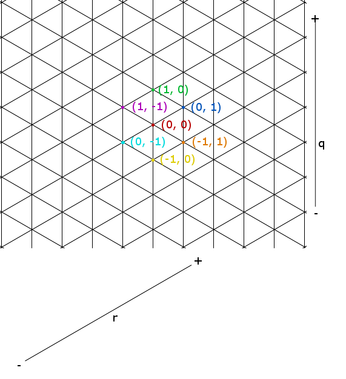
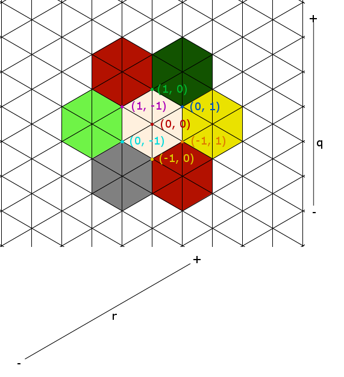
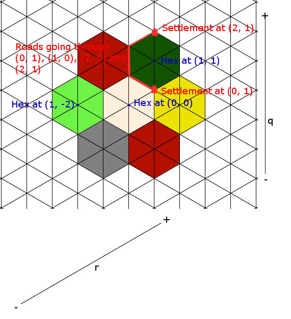

Working with the Board
======================

The hexes, paths and intersections in PyCatan use a unique grid system, (q, r) instead of (x, y)
To convert to (x, y) is simple: ::

    x = sqrt(3) / 2 * r
    y = q + 0.5 * r

(q, r) is simply a skewed 2D grid, where the x axis is rotated 30 degrees counter clockwise.
PyCatan uses (q, r) because each intersection and hex will have its own unique integer coordinate:

It also allows for boards of any shape or size, although PyCatan by default only includes the default 3-4-5-4-3 board shape.
Finding which intersections are connected to which hexes is also greatly simplified: ::

    def get_intersections_connected_to_hex(hex_coords: Tuple):
        return [(offset[0] + hex_coords[0], offset[1] + hex_coords[1]) for offset in {(1, 0), (0, 1), (1, -1), (-1, 1), (-1, 0), (0, -1)}]

All of this is done behind the hood of PyCatan, but if you are expanding the library it is important to know.
